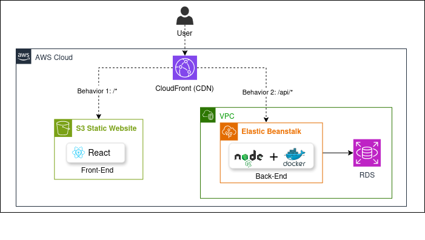
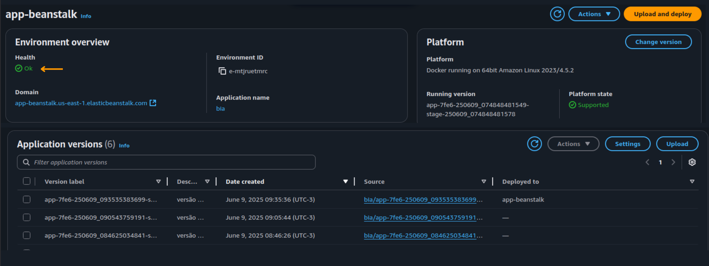
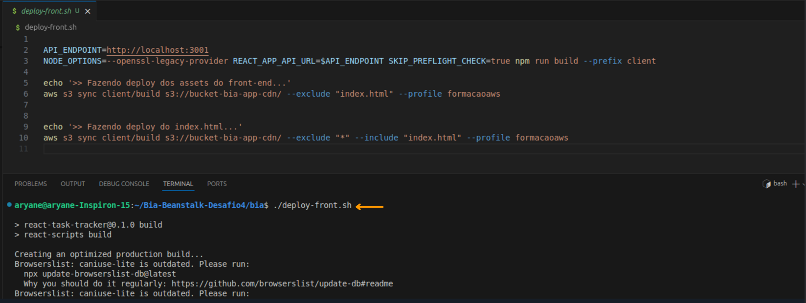
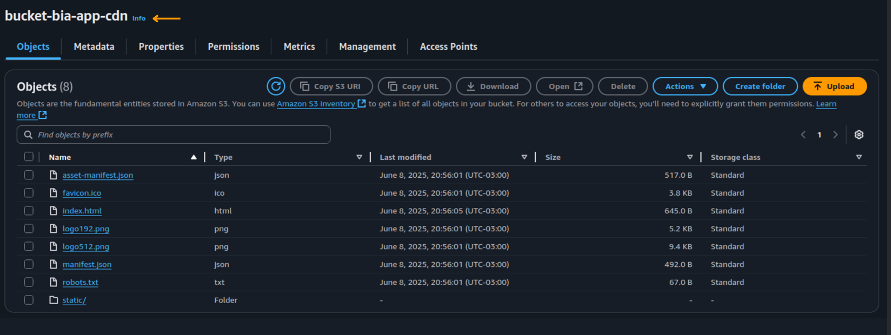
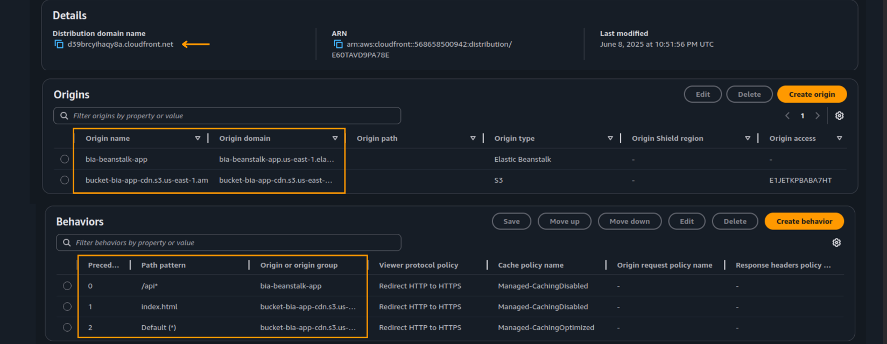
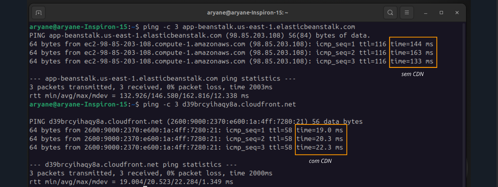
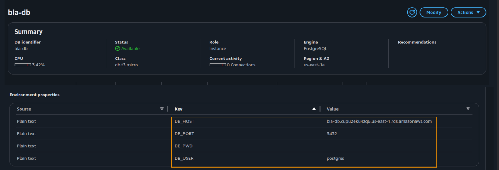
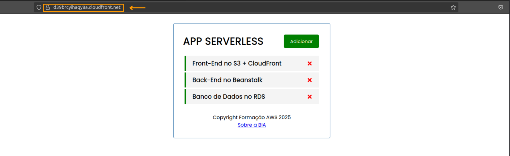

# 🚀 Projeto Elastic Beanstalk com Docker e CDN (CloudFront)

Este repositório documenta o desafio prático da **Mentoria Desafio Labs 2.0**, parte da **Formação AWS** conduzida por **Henrylle Maia**. O projeto tem como foco a criação de uma solução escalável e resiliente, unindo **Elastic Beanstalk, Docker e distribuição de conteúdo via CloudFront**, com automação de deploy e boas práticas em arquitetura cloud-native.

---

## 🧠 Objetivo

Criar uma aplicação containerizada com **deploy automatizado via AWS Elastic Beanstalk**, integrando **Amazon ECR**, **CloudWatch para monitoramento**, armazenamento de arquivos estáticos no **S3** e distribuição via **Amazon CloudFront**, promovendo desempenho otimizado, resiliência e observabilidade.

---

## 📊 Arquitetura da Solução

A solução contempla os seguintes componentes:

- Aplicação Dockerizada executando no **Elastic Beanstalk**  
- Imagens armazenadas no **Amazon ECR**  
- Logs e métricas monitorados via **Amazon CloudWatch**  
- Assets estáticos hospedados no **Amazon S3**  
- Distribuição de conteúdo via **Amazon CloudFront**  
- Automação de processos com **Shell Scripts**  
- Variáveis de ambiente sensíveis configuradas com segurança

---

## 📌 Etapas do Projeto

### Fase 1 – Deploy Gerenciado com Docker
- Configuração do ambiente Elastic Beanstalk com suporte a Docker  
- Build e push da imagem Docker para o Amazon ECR  
- Deploy contínuo da aplicação com versionamento e rollback

### Fase 2 – Observabilidade e Diagnóstico
- Configuração de métricas e alarmes via CloudWatch  
- Análise de logs e troubleshooting de erros no deploy  

### Fase 3 – Integração com S3 e CDN
- Upload de assets estáticos (ex: imagens) para bucket no S3  
- Criação de uma distribuição CloudFront apontando para o S3  
- Testes de latência e validação de cache  

### Fase 4 – Automação e Boas Práticas
- Shell scripts para automação do deploy e limpeza de versões antigas  
- Configuração de variáveis de ambiente (como URIs e keys sensíveis)  
- Estruturação do repositório para reusabilidade e manutenção

---

## 🛠️ Tecnologias e Serviços Utilizados

| Categoria           | Tecnologias                                                                 |
|---------------------|------------------------------------------------------------------------------|
| Containers          | Docker, Amazon ECR, AWS Elastic Beanstalk                                   |
| Armazenamento       | Amazon S3                                                                    |
| Distribuição (CDN)  | Amazon CloudFront                                                            |
| Monitoramento       | AWS CloudWatch                                                               |
| Automação           | Shell Script                                                                 |
| Segurança           | Configuração de variáveis de ambiente no Elastic Beanstalk                   |

---

## ✅ Resultados Obtidos

- Deploy automatizado e versionado com Docker no Elastic Beanstalk  
- Integração eficiente com o Amazon ECR para gerenciamento de imagens  
- Observabilidade robusta com métricas e logs no CloudWatch  
- Distribuição de conteúdo via CloudFront, com menor latência e alta performance  
- Armazenamento seguro de arquivos no Amazon S3  
- Scripts Shell reutilizáveis para automação dos processos de deploy  

---

## 📷 Capturas de Tela

### 📐 Arquitetura da Solução

> Diagrama geral da arquitetura cloud-native implementada, integrando Elastic Beanstalk, Amazon S3, CloudFront, ECR e RDS

---

### 🚀 Ambiente no Elastic Beanstalk

> Tela do ambiente configurado no Elastic Beanstalk com aplicação Docker em execução.

---

### 💾 Deploy de Assets Estáticos

> Processo de build e deploy automatizado dos arquivos estáticos para o bucket S3.

---

### 🪣 Bucket Amazon S3

> Visualização dos arquivos estáticos armazenados no bucket S3, prontos para distribuição.

---

### 🌍 Distribuição via Amazon CloudFront

> Configuração da distribuição e mapeamento do bucket S3 como origem, garantindo baixa latência e cache global.

---

### ⚡ Validação de Latência com CloudFront

> Testes de desempenho e latência evidenciam ganho significativo ao utilizar a CDN da AWS.

---

### 🧩 Integração com Banco de Dados RDS

> Estruturação da aplicação com comunicação segura com banco de dados relacional no Amazon RDS.

---

### 💻 Aplicação Web em Execução

> Interface web acessível após o deploy bem-sucedido no Elastic Beanstalk.

---

## 📄 Licença

Este projeto foi desenvolvido exclusivamente para fins educacionais como parte da formação profissional em AWS. Sem fins comerciais.

---

## 💬 Contato

Se quiser trocar ideias sobre aplicações gerenciadas, CDN, automação e arquitetura na nuvem, estou à disposição:

- **LinkedIn:** [linkedin.com/in/aryane-andrade](https://www.linkedin.com/in/aryane-andrade)  
- **Email:** aryaneands@gmail.com  

---

> 🔥 Projeto desenvolvido por Aryane, consolidando conhecimentos em Elastic Beanstalk, Docker, S3, CloudFront, ECR e CloudWatch na AWS. Foco em escalabilidade, performance, segurança e automação.
